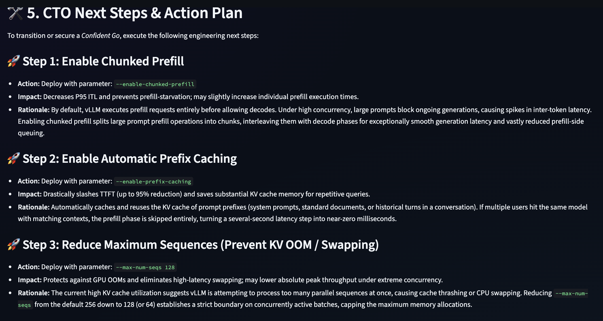

# AI Launch Readiness Agent

## Screenshots

### Launch Planning Input

### Launch Readiness Assessment

### Recommendations

**Before you launch an AI feature, get a virtual review from an AI Infrastructure Lead.**

AI teams can build prototypes in days. Launching them reliably, cost-effectively, and at scale is much harder.

AI Launch Readiness Agent helps founders, builders, and product teams evaluate whether an AI feature is truly ready for production by reviewing cost, reliability, scalability, observability, and operational risks.

## The Problem

Many AI launches fail because teams underestimate:

* AI inference costs
* Latency and scalability challenges
* Reliability and on-call requirements
* Evaluation and quality measurement gaps
* Capacity planning needs
* Operational readiness

Large companies typically conduct launch reviews involving infrastructure, reliability, product, and machine learning experts before shipping AI features.

Most startups do not have access to that expertise.

## The Solution

AI Launch Readiness Agent acts as a virtual AI launch review board.

Users describe their planned AI feature, expected traffic, latency goals, budget, and reliability requirements.

The agent evaluates:

* Cost readiness
* Reliability readiness
* Capacity readiness
* Evaluation readiness
* Observability readiness

And produces:

* Launch Readiness Score
* Go / Go With Caution / No-Go recommendation
* Top launch risks
* Recommended mitigations
* Executive summary for founders and CTOs

## Example

### Input

Feature: AI Customer Support Agent

Expected DAU: 100,000

Requests per User per Day: 20

Model: Gemini 2.5 Pro

Latency Target: 2 seconds

Monthly AI Budget: $20,000

Reliability Target: 99.9%

### Output

Launch Readiness Score: 68/100

Verdict: GO WITH CAUTION

Top Risks:

* AI costs likely exceed budget
* No fallback model strategy
* Missing evaluation framework

Recommendations:

* Route simple requests to a lower-cost model
* Define quality evaluation metrics
* Implement fallback and rate-limiting strategy

## How It Works

The system combines:

### Launch Review Agent

A managed AI agent that performs launch-readiness analysis and recommendation generation.

### Infrastructure Analysis Engine

Domain-specific analysis for:

* Capacity planning
* Model serving readiness
* Reliability risks
* Latency constraints
* Cost considerations

### Recommendation Engine

Generates actionable launch recommendations with rationale and expected impact.

## Example Review Dimensions

### Can You Afford This?

* Monthly AI spend projections
* Cost scaling analysis
* Budget risk assessment

### Will It Stay Up?

* Reliability requirements
* Failure mode analysis
* Operational readiness

### Can It Scale?

* Traffic projections
* Capacity considerations
* Growth assumptions

### How Will You Know It's Working?

* Evaluation framework
* Success metrics
* Monitoring requirements

## Why This Matters

Most AI development tools help teams build AI features.

Very few help teams determine whether those features are ready to launch.

AI Launch Readiness Agent focuses on the operational and business realities of deploying AI systems into production.

## Built With

* Google Gemini
* Managed Agents
* Antigravity
* Streamlit
* Python

## Future Roadmap

* Real cloud cost estimation
* Production telemetry integration
* Launch review history
* Team collaboration workflows
* Automated launch checklists
* Multi-agent architecture reviews

## Inspiration

This project was inspired by the production launch reviews used for large-scale AI systems at leading technology companies. The goal is to make that expertise accessible to startups and builders.
