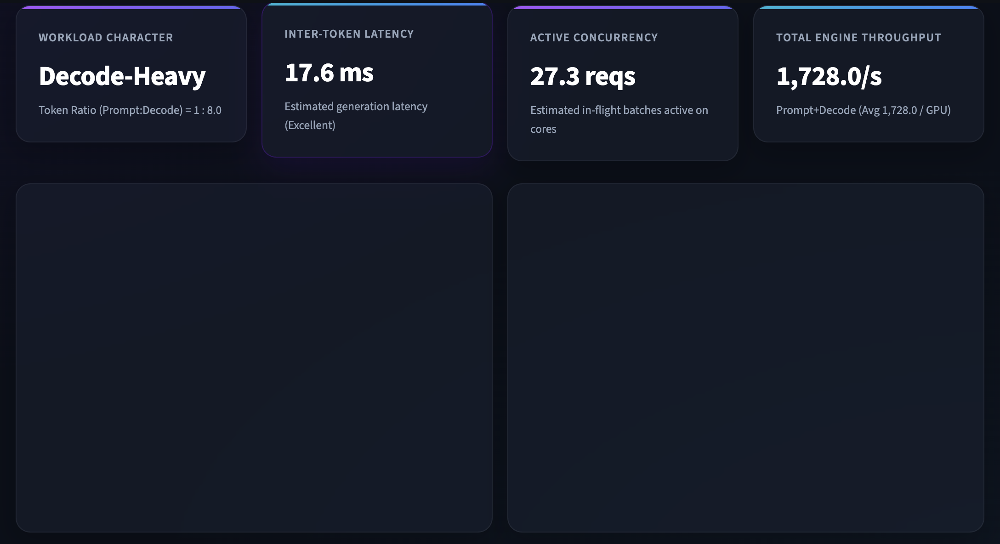
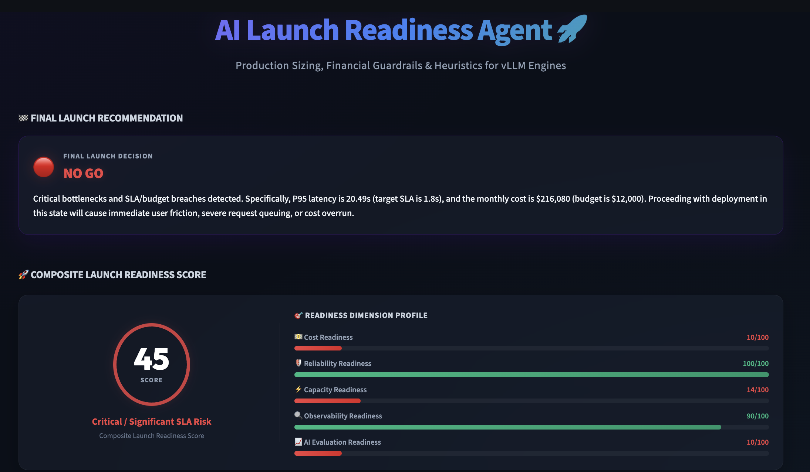

# AI Launch Readiness Agent

Before you launch an AI feature, get a virtual review from an AI Infrastructure Lead.

Think of this as a virtual AI infrastructure review board that tells you whether you're actually ready to launch.

AI teams can build prototypes in days. Launching them reliably, cost-effectively, and at scale is much harder.

## Screenshots

### Launch Planning Input

### Launch Readiness Assessment

### Recommendations

## Why This Matters

Many founders launch AI features without understanding:

- How much they will cost
- Whether they will scale
- Whether they will meet latency goals
- How reliability incidents will be handled
- Whether they have the right evaluation framework

Large companies run launch reviews before shipping AI systems.

Most startups don't.

AI Launch Readiness Agent brings that expertise to founders and builders.

## The Problem

Many AI launches fail because teams underestimate:

* AI inference costs
* Latency and scalability challenges
* Reliability and on-call requirements
* Evaluation and quality measurement gaps
* Capacity planning needs
* Operational readiness

Large companies typically conduct launch reviews involving infrastructure, reliability, product, and machine learning experts before shipping AI features.

Most startups do not have access to that expertise.

## The Solution

AI Launch Readiness Agent acts as a virtual AI launch review board.

Users describe their planned AI feature, expected traffic, latency goals, budget, and reliability requirements.

The agent evaluates:

* Cost readiness
* Reliability readiness
* Capacity readiness
* Evaluation readiness
* Observability readiness

And produces:

* Launch Readiness Score
* Go / Go With Caution / No-Go recommendation
* Top launch risks
* Recommended mitigations
* Executive summary for founders and CTOs

## Example

### Input

Feature: AI Customer Support Agent

Expected DAU: 100,000

Requests per User per Day: 20

Model: Gemini 2.5 Pro

Latency Target: 2 seconds

Monthly AI Budget: $20,000

Reliability Target: 99.9%

### Output

Launch Readiness Score: 68/100

Verdict: GO WITH CAUTION

Top Risks:

* AI costs likely exceed budget
* No fallback model strategy
* Missing evaluation framework

Recommendations:

* Route simple requests to a lower-cost model
* Define quality evaluation metrics
* Implement fallback and rate-limiting strategy

## How It Works

## Managed Agent Architecture

The AI Launch Readiness Agent acts as a virtual review board.

It uses specialized tools for:

- Capacity analysis
- Cost analysis
- Reliability review
- Launch risk assessment
- Recommendation generation

The managed agent orchestrates these analyses and produces a launch recommendation.

The system combines:

### Launch Review Agent

A managed AI agent that performs launch-readiness analysis and recommendation generation.

### Infrastructure Analysis Engine

Domain-specific analysis for:

* Capacity planning
* Model serving readiness
* Reliability risks
* Latency constraints
* Cost considerations

### Recommendation Engine

Generates actionable launch recommendations with rationale and expected impact.

## Example Review Dimensions

### Can You Afford This?

* Monthly AI spend projections
* Cost scaling analysis
* Budget risk assessment

### Will It Stay Up?

* Reliability requirements
* Failure mode analysis
* Operational readiness

### Can It Scale?

* Traffic projections
* Capacity considerations
* Growth assumptions

### How Will You Know It's Working?

* Evaluation framework
* Success metrics
* Monitoring requirements

## Built With

* Google Gemini
* Managed Agents
* Antigravity
* Streamlit
* Python

## Future Roadmap

* Real cloud cost estimation
* Production telemetry integration
* Launch review history
* Team collaboration workflows
* Automated launch checklists
* Multi-agent architecture reviews

## Inspiration

This project was inspired by the production launch reviews used for large-scale AI systems at leading technology companies. The goal is to make that expertise accessible to startups and builders.
