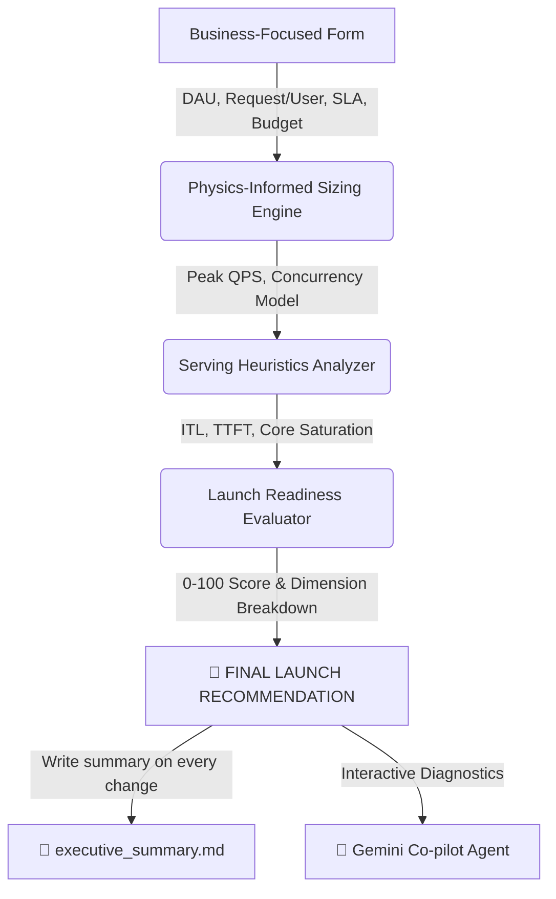

# AI Launch Readiness Agent 🚀 — Enterprise Model Serving & Sizing Guardrail

The **AI Launch Readiness Agent** is a state-of-the-art diagnostic and sizing engine built for **vLLM** and modern LLM serving infrastructures. It translates high-level business goals (such as Daily Active Users, monthly budgets, and latency SLAs) into concrete, physics-informed hardware cluster configurations and operational readiness metrics. 

---

## 🚀 Quick Start & Local Execution

### 1. Installation
Ensure Python 3.9+ is configured. Clone this repository and install the standard dependency stack:
```bash
pip install -r requirements.txt
```

### 2. Run the Dashboard Console
Launch the local development Streamlit server:
```bash
streamlit run app.py
```
This automatically starts the server and opens the dashboard console in your default browser at `http://localhost:8501`.

---

## 🛠️ Unified Architecture



*   **`app.py`:** Standard Streamlit visual console styled with rich glassmorphism elements, real-time interactive sliders, performance gauges, and dynamic tab rendering.
*   **`serving_analyzer.py`:** Computational heuristics core translating business metrics into sequential decode times, queuing boundaries, and replica scale requirements.
*   **`serving_agent.py`:** Stateful, multi-tool **Google Antigravity SDK Agent** powered by Gemini, allowing engineers and leaders to diagnose server performance via natural language.

---

## 📈 5-Dimension Launch Readiness Profile

The application evaluates your deployment candidate across five rigorous engineering dimensions, producing an overall **Launch Readiness Score (0-100)**:

1.  **💵 Cost Readiness (0-100):** Grades compliance against your monthly AI hosting budget. Satisfied completely (100) if cluster lease fees fit comfortably within limits.
2.  **🛡️ Reliability Readiness (0-100):** Audits redundancy. Scores full points (100) if high-availability active-active replication targets (e.g. redundant replicas) are provisioned.
3.  **⚡ Capacity Readiness (0-100):** Measures GPU compute core occupancy and KV Cache High-Bandwidth Memory (HBM) pressure under simulated peak hours.
4.  **🔍 Observability Readiness (0-100):** Evaluates log exposure, transaction tracing, and performance profiling headroom.
5.  **📈 AI Evaluation Readiness (0-100):** Measures SLA conformance, grading latency degradation under queue pressure against your target millisecond budget.

---

## 🏁 Programmatic Launch Decision Matrix

To ensure unbiased deployment sign-offs, the system implements a rigid, programmatic decision heuristic based on live SLAs and capacity limits:

| Verdict | Triggering Criteria | Operational Meaning |
| :--- | :--- | :--- |
| **`GO`** | <ul><li>Overall Score $\ge 85$</li><li>SLA Latency Targets met (`P95 <= Target`)</li><li>Estimated costs $\le$ monthly budget</li><li>Hardware core margins comfortable</li></ul> | **Production Ready:** Clear path to launch. The system operates with ample headroom to handle peak-hour traffic spikes and remains fully budget-compliant. |
| **`GO WITH CAUTION`** | <ul><li>Overall Score between $60$ and $84$</li><li>*OR* Core Status is `WARNING`</li><li>*OR* P95 latency slightly breaches target SLA</li><li>*OR* Cost exceeds budget headroom</li><li>*OR* High KV Cache pressure ($> 80\%$)</li></ul> | **Remediation Advised:** The deployment is viable under standard loads, but runs the risk of latency spikes, queuing timeouts, or financial overruns under peak bursts. Tuning (quantization, prefix caching, replica scaling) is highly recommended. |
| **`NO GO`** | <ul><li>Overall Score $< 60$</li><li>*OR* Core Status is `CRITICAL`</li><li>*OR* Latency exceeds SLA by $> 1.5\text{x}$</li><li>*OR* GPU Lease Cost exceeds budget by $> 30\%$</li></ul> | **Immediate Release Block:** Critical bottleneck detected. High threat of immediate server crash (OOM), queuing starvation (TTFT $> 4\text{s}$), or budget overruns. Deploying in this state will cause immediate user friction. |

---

## 📁 Dynamically Compiled CTO/Founder Summaries

On every parameter update, slider move, or preset change, the engine compiles a dynamic markdown document summarizing the full deployment audit:
*   **Written To:** `brain/<conversation-id>/executive_summary.md`
*   **Contents:** Prominent final decision alerts, readiness dimension assessment tables, ranked lists of the **Top 3 Severest Risks**, Mermaid-based budget allocation pie charts, and step-by-step engineering next-actions for the engineering team.

---

## 🧠 Stateful Gemini Co-Pilot

The dashboard integrates a stateful conversational assistant. Backed by the **Google Antigravity SDK**, this agent leverages specific tools to parse engine state:
1.  `classify_workload`: Determines if the request pattern is Prefill-bound, Decode-bound, or Balanced.
2.  `analyze_kv_cache`: Audits device context allocation and swapping risks.
3.  `analyze_latency`: Analyzes prompt arrival queues (TTFT) and decode speeds (ITL).
4.  `recommend_optimizations`: Outputs copy-paste vLLM CLI parameters customized to the bottleneck.

### Running the CLI Agent Directly
Set your Gemini API key in your terminal:
```bash
export GEMINI_API_KEY="your-gemini-key"
```
*   **Single Query Audit:**
    ```bash
    .venv311/bin/python serving_agent.py "Audit a Llama 3 8B workload with 35k DAU, target 1.8s SLA, and A100 GPUs."
    ```
*   **Interactive Terminal Session:**
    ```bash
    .venv311/bin/python serving_agent.py --interactive
    ```
